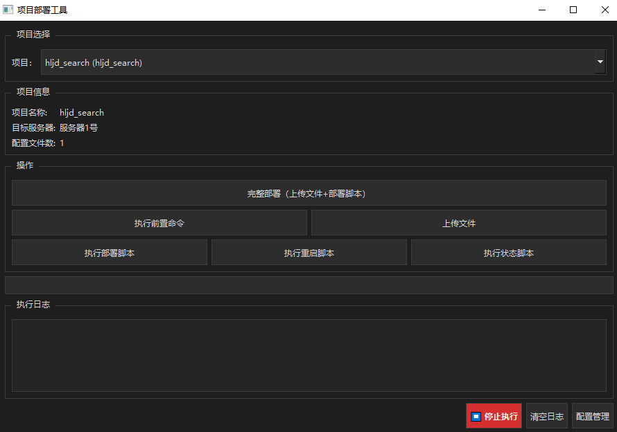
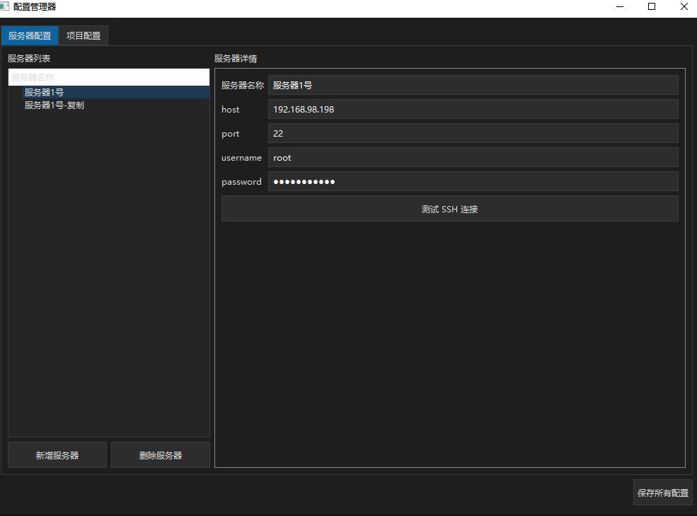
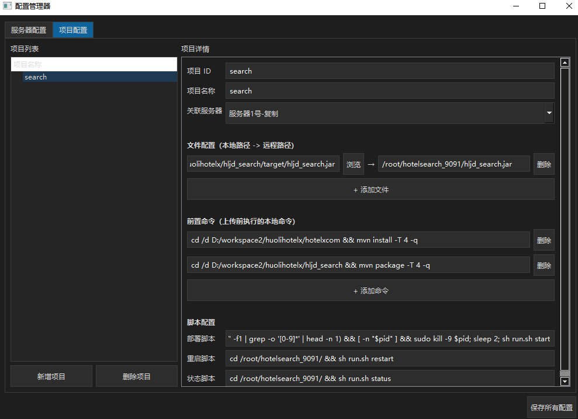

# Quick Deploy - 项目快速部署工具

一款基于 PyQt6 的可视化项目部署工具，支持通过 SSH 将本地构建产物上传到远程服务器并执行部署脚本，实现一键完成 **本地构建 → 文件上传 → 远程部署** 的完整流程。

## 功能特性

- **可视化操作界面**：深色主题 GUI，操作直观简洁
- **多服务器管理**：支持配置和管理多台远程服务器，可快速复制已有配置
- **多项目管理**：支持配置多个部署项目，每个项目独立关联服务器、文件和脚本
- **前置命令执行**：上传前自动执行本地命令（如 Maven 构建、npm 打包等）
- **SSH 文件上传**：通过 SFTP 上传文件到远程服务器，支持上传进度实时显示
- **远程脚本执行**：支持在远程服务器执行部署、重启、状态检查脚本，实时回显日志
- **一键完整部署**：一个按钮完成前置命令 → 文件上传 → 部署脚本的全流程
- **操作可中断**：所有操作均支持随时停止
- **SSH 连接测试**：配置服务器后可一键测试连接是否正常
- **配置持久化**：所有配置保存在 `config.json` 文件中，首次运行自动生成默认配置

## 界面预览

### 主界面



主界面包含：项目选择、项目信息展示、操作按钮（完整部署 / 执行前置命令 / 上传文件 / 执行部署脚本 / 执行重启脚本 / 执行状态脚本）、进度条和实时执行日志。

### 服务器配置



配置服务器的 SSH 连接信息（主机地址、端口、用户名、密码），支持测试连接。

### 项目配置



配置项目的关联服务器、前置命令、文件映射（本地路径 → 远程路径）、部署/重启/状态脚本。

## 环境要求

- Python 3.8+
- Windows / macOS / Linux

## 直接使用 Python 运行

### 1. 安装依赖

```bash
pip install PyQt6 paramiko
```

### 2. 运行程序

```bash
python deploy.py
```

首次运行会自动在当前目录生成 `config.json` 默认配置文件，之后可通过界面中的「配置管理」按钮进行可视化配置。

## 打包为 EXE 可执行文件

使用 PyInstaller 可以将程序打包为独立的 `.exe` 文件，无需安装 Python 环境即可运行。

### 1. 安装 PyInstaller

```bash
pip install pyinstaller
```

### 2. 执行打包命令

```bash
pyinstaller --onefile --windowed --name "QuickDeploy" deploy.py
```

参数说明：

| 参数 | 说明 |
|------|------|
| `--onefile` | 打包为单个 exe 文件 |
| `--windowed` | 不显示控制台窗口（GUI 程序推荐） |
| `--name "QuickDeploy"` | 指定生成的 exe 文件名 |

### 3. 获取打包结果

打包完成后，生成的文件在 `dist/` 目录下：

```
dist/
└── QuickDeploy.exe
```

直接双击 `QuickDeploy.exe` 即可运行，无需安装任何依赖。

### 4. 自定义图标（可选）

如果需要自定义 exe 图标，准备一个 `.ico` 格式的图标文件，然后执行：

```bash
pyinstaller --onefile --windowed --name "QuickDeploy" --icon=app.ico deploy.py
```

## 配置说明

所有配置保存在 `config.json` 中，也可以通过界面的「配置管理」按钮可视化编辑。配置结构如下：

```json
{
    "servers": {
        "服务器名称": {
            "host": "192.168.1.100",
            "port": 22,
            "username": "root",
            "password": "your_password"
        }
    },
    "projects": {
        "项目ID": {
            "name": "项目显示名称",
            "server": "服务器名称",
            "pre_commands": [
                "cd /d D:/project && mvn clean package"
            ],
            "files": [
                {
                    "local": "D:/project/target/app.jar",
                    "remote": "/opt/app/app.jar"
                }
            ],
            "scripts": {
                "deploy": "cd /opt/app && ./deploy.sh",
                "restart": "cd /opt/app && ./restart.sh",
                "status": "cd /opt/app && ./status.sh"
            }
        }
    }
}
```

### 配置字段说明

**服务器配置（servers）**

| 字段 | 说明 |
|------|------|
| `host` | 服务器 IP 地址或域名 |
| `port` | SSH 端口号（默认 22） |
| `username` | SSH 登录用户名 |
| `password` | SSH 登录密码 |

**项目配置（projects）**

| 字段 | 说明 |
|------|------|
| `name` | 项目显示名称 |
| `server` | 关联的服务器名称（对应 servers 中的 key） |
| `pre_commands` | 上传前执行的本地命令列表（如构建命令） |
| `files` | 文件映射列表，每项包含 `local`（本地路径）和 `remote`（远程路径） |
| `scripts.deploy` | 部署脚本命令 |
| `scripts.restart` | 重启脚本命令 |
| `scripts.status` | 状态检查脚本命令 |

## 典型使用流程

1. 打开程序，点击「配置管理」
2. 在「服务器配置」标签页添加远程服务器信息，点击「测试 SSH 连接」验证连通性
3. 在「项目配置」标签页添加部署项目，配置前置命令、文件映射和部署脚本
4. 保存配置，回到主界面
5. 选择要部署的项目，点击「完整部署」按钮即可一键完成全流程

## 注意事项

- `config.json` 中包含服务器密码等敏感信息，已在 `.gitignore` 中排除，请勿提交到版本库
- 打包后的 exe 文件运行时，`config.json` 需要放在 exe 同级目录下
- Windows 环境下前置命令使用 `cmd` 执行，Linux/macOS 使用 `bash` 执行
